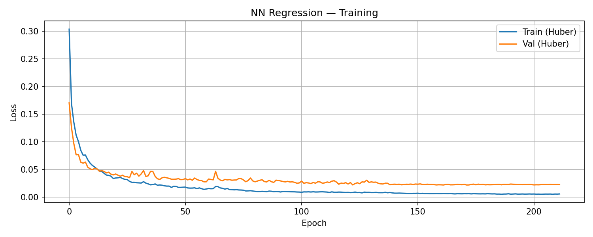
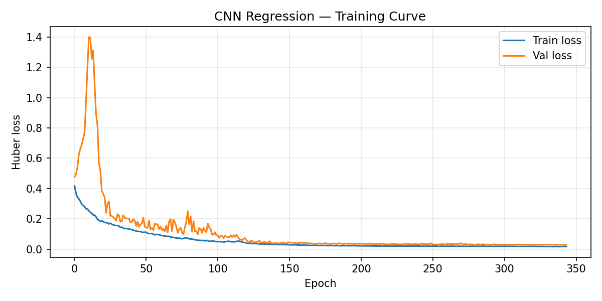
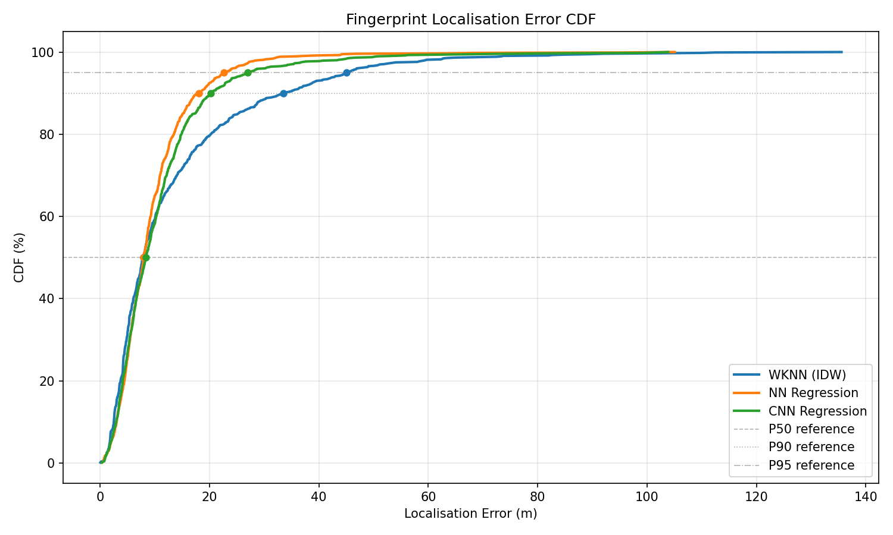
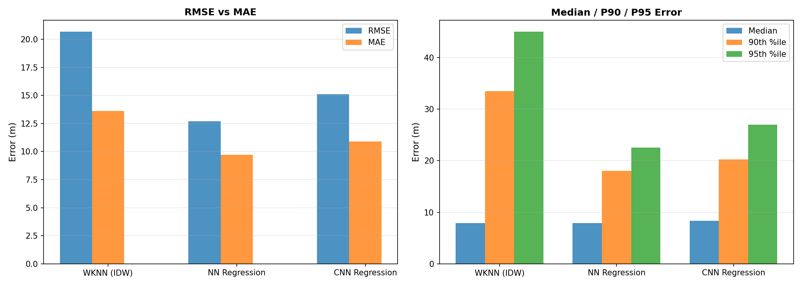
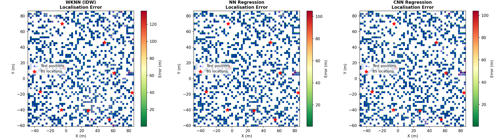

# 03 — Fingerprint Localization

Loads (or generates) the CSI fingerprint dataset and evaluates the enabled
localisation methods as configured in ``features_config.json``.

**Scene:** `Otaniemi_small/Otaniemi_small.xml`
**Data:** `Otaniemi_small-ablation-2026-04-14-215353/ALL`

**Requires:** `fingerprint_rt_dataset.h5` in the data directory
(generated by `01_generate_dataset.py`).

    No fingerprint cache found. Running generator…
    Added 3186 fingerprint receivers to scene
    Running PathSolver on fingerprint grid …
    PathSolver complete.
    H_fp shape: (1, 3186, 1, 9, 1, 1, 3168)
    Covariance eigenvalue features computed: (3186, 27)
    Imputed 982 unreached (rx, tx) pairs across 9 TXs
    Feature shape: (3186, 3690)  (3555 OFDM + 36 TDoA + 36 AoA + 9 RSS + 9 path-loss + 9 delay + 27 cov-eig + 9 reached-flags)
    Saved fingerprint cache → /home/jarikarp/analyse/Machine-Learning-for-Wireless-Comunications-E7340/Project/Otaniemi_small/fingerprint_rt_dataset.h5
    Scene receivers restored.
    Generated fingerprints: (3186, 3690)

    Train: 2230  |  Test: 956  |  Features: 3690

    wKNN  (k=3)  MAE=13.61 m  RMSE=20.66 m  Median=7.88 m  P90=33.53 m  P95=45.00 m

### NN Regression — Training Curve

    NN Reg   MAE=9.70 m  RMSE=12.69 m  Median=7.92 m  P90=18.01 m  P95=22.58 m

### CNN Regression — Training Curve

    CNN Reg  MAE=10.89 m  RMSE=15.09 m  P90=20.26 m  P95=26.97 m  [410 feat/TX × 9 TX]

### Localisation Error CDF

    ======================================================================
    LOCALIZATION SUMMARY
    ======================================================================
    Method                    MAE    RMSE   Median     P90     P95
    ---------------------------------------------------------------
      WKNN (IDW)            13.61   20.66     7.88   33.53   45.00
      NN Regression          9.70   12.69     7.92   18.01   22.58
      CNN Regression        10.89   15.09     8.36   20.26   26.97

### Metrics Comparison

### Spatial Error Heatmaps

    Saved → Otaniemi_small-ablation-2026-04-14-215353/ALL/fingerprint_localization_results.csv
    Saved → Otaniemi_small-ablation-2026-04-14-215353/ALL/fingerprint_localization_summary.json

## Analysis

3 localisation method(s) were evaluated on a 956-sample
test set held out from the CSI fingerprint grid.

| Method | MAE (m) | RMSE (m) | Median (m) | P90 (m) | P95 (m) |
|--------|---------|----------|------------|---------|--------|
| WKNN (IDW) | 13.61 | 20.66 | 7.88 | 33.53 | 45.00 |
| NN Regression | 9.70 | 12.69 | 7.92 | 18.01 | 22.58 |
| CNN Regression | 10.89 | 15.09 | 8.36 | 20.26 | 26.97 |

**wKNN** is a non-parametric baseline: each test point is estimated as the
IDW-weighted centroid of its *k* nearest neighbours in the fingerprint library.
It is robust with small datasets but does not generalise beyond the grid.

**NN Regression** treats localisation as a direct coordinate regression problem.
With enough training data and a well-conditioned loss (Huber), it can outperform
wKNN in MAE while maintaining lower variance.

**NN Classification** maps each fingerprint to a discrete grid cell.  Accuracy
can be low when the grid is fine or the dataset is small — the network may fail
to separate adjacent-cell fingerprints from limited observations.

**CNN Regression** treats the feature matrix as a 2-D image where each column
is one BS.  Convolutional filters capture cross-BS spatial correlations that
fully-connected layers may miss.

The CDF plot above shows the empirical distribution of per-test-point errors.
A curve shifted leftmost indicates better performance for a given error budget.
