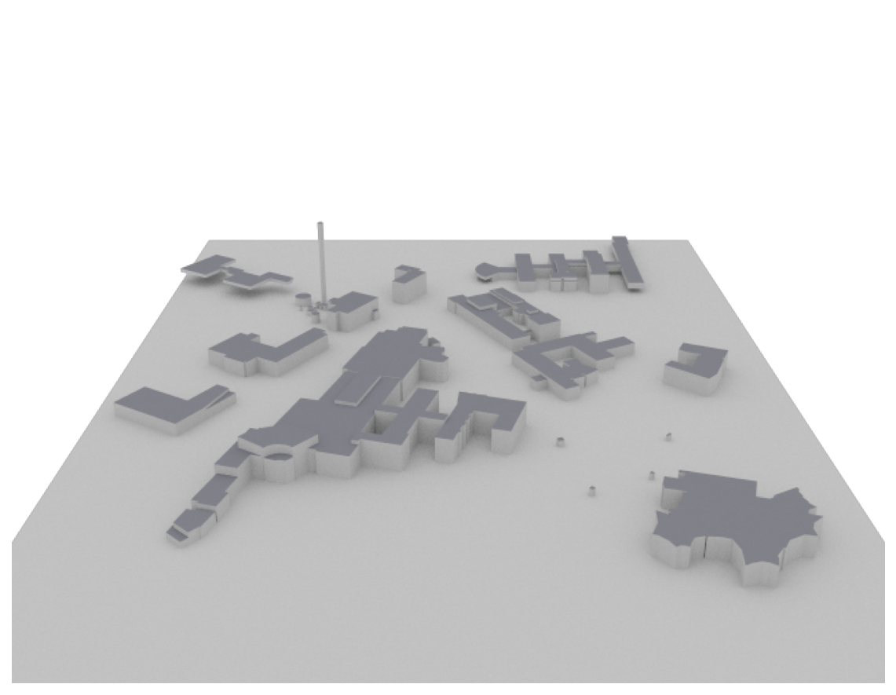
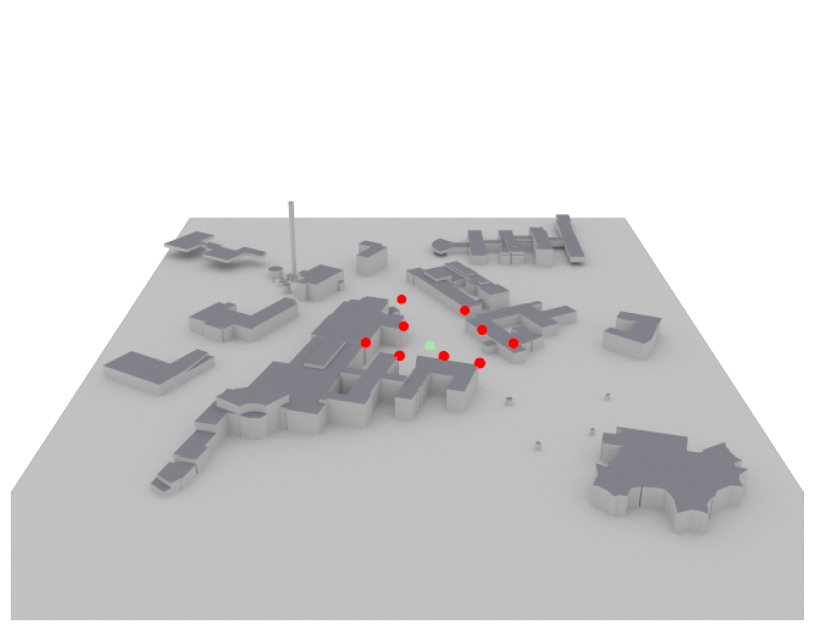
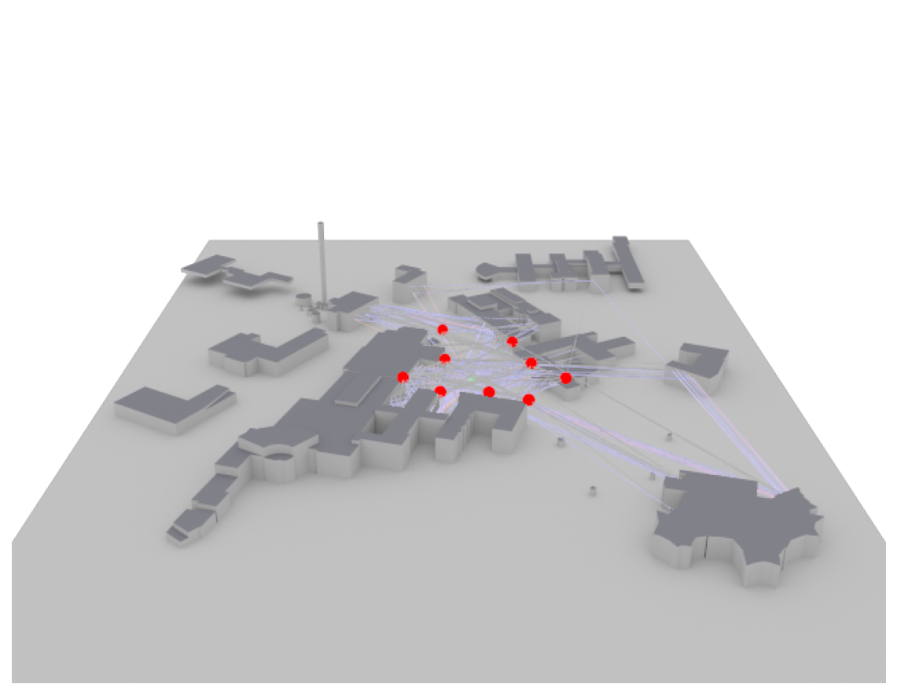
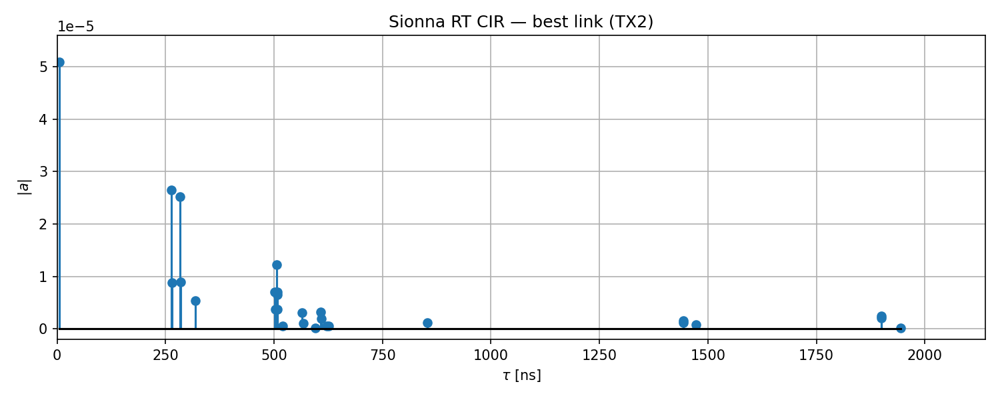
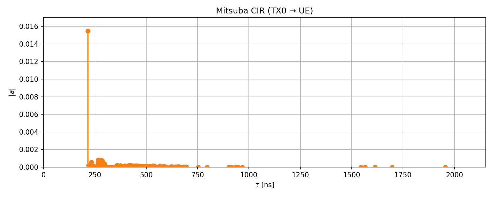

# 01 — Generate Dataset

Runs Sionna RT and Mitsuba ray tracing over the selected scene and exports HDF5 datasets.

**Scene:** `Otaniemi_small/Otaniemi_small.xml`  
**Output:** `Otaniemi_small-results-2026-04-15-193158`

**Outputs written to `OUTPUT_DIR/`:**
- `sionna_dataset.h5` — complex channel coefficients and OFDM channel matrix
- `mitsuba_dataset.h5` — Mitsuba path delays and amplitudes
- `sionna_paths.csv` — per-path delay / amplitude / gain (Sionna)
- `mitsuba_paths.csv` — per-path delay / amplitude / gain (Mitsuba)

### Scene Configuration

| Parameter | Value |
|-----------|-------|
| Scene name | `Otaniemi_small` |
| Scene XML | `Otaniemi_small/Otaniemi_small.xml` |
| Carrier frequency | `3.600 GHz` |
| TX power | `40.0 dBm` |
| FFT size | `3168` |
| Subcarrier spacing | `30 kHz` |
| BS antenna height | `19.0 m` |
| UE antenna height | `1.25 m` |
| Grid X range | `-47.5 … 85.0 m` |
| Grid Y range | `-60.0 … 85.0 m` |
| Grid spacing | `2.5 m` |
| Max reflection depth | `4` |
| Max ray depth | `4` |
| Transmitters | `9` |
| Reference UE pos | `(18.75, 12.5, 1.25)` |

**Transmitter positions (x, y, z) [m]:**

| TX | x | y | z |
|----|---|---|---|
| TX0 | -5.0 | 70.0 | 19.0 |
| TX1 | -33.0 | -17.0 | 19.0 |
| TX2 | -3.0 | 14.0 | 19.0 |
| TX3 | -6.0 | -40.0 | 19.0 |
| TX4 | 55.0 | -52.5 | 19.0 |
| TX5 | 61.0 | 7.0 | 19.0 |
| TX6 | 49.0 | 46.0 | 19.0 |
| TX7 | 28.0 | -41.0 | 19.0 |
| TX8 | 84.0 | -18.0 | 19.0 |

    No GPU — running on CPU
    Mitsuba variant: llvm_ad_mono_polarized

    Scene loaded: Otaniemi_small/Otaniemi_small.xml
    Added 9 transmitters.
    UE at [18.75, 12.5, 1.25]

### Scene Render

    Scene render saved → Otaniemi_small-results-2026-04-15-193158/pictures/01_generate_dataset/scene_render.png

### Scene with Devices

    Scene with devices saved → Otaniemi_small-results-2026-04-15-193158/pictures/01_generate_dataset/scene_with_devices.png

    OFDM: 3168 sub-carriers, Δf=30 kHz, fc=3.600 GHz
    PathSolver complete.
      Paths tau shape: (1, 9, 30)

### Scene with Paths

    Scene with paths saved → Otaniemi_small-results-2026-04-15-193158/pictures/01_generate_dataset/scene_with_paths.png

    a shape: (1, 1, 9, 16, 30, 1)
    tau shape: (1, 9, 30)
    H shape: (1, 1, 1, 9, 16, 1, 3168)

### Sionna RT — Channel Impulse Response

    Plotting CIR: TX2 (27 valid paths).

    Saved → Otaniemi_small-results-2026-04-15-193158/sionna_dataset.h5  (3.39 MB)
    Saved → Otaniemi_small-results-2026-04-15-193158/sionna_paths.csv  (2880 paths, 97.9 KB)

### Mitsuba — Channel Impulse Response

    Mitsuba scene loaded: Otaniemi_small/Otaniemi_small.xml
    Mitsuba traced 440 paths (TX0 → UE).
    Plotted 440 valid paths.

    Saved → Otaniemi_small-results-2026-04-15-193158/mitsuba_dataset.h5  (0.02 MB)
    Saved → Otaniemi_small-results-2026-04-15-193158/mitsuba_paths.csv  (440 paths, 26.4 KB)

## Analysis

Both Sionna RT and Mitsuba independently traced multipath propagation through the scene.

**Sionna RT** solves the full electromagnetic problem including diffraction and produces
complex-valued per-path channel coefficients (`a`), delays (`tau`), and the OFDM
channel matrix `H`.  The data are saved as compressed HDF5 for downstream use.

**Mitsuba** performs geometric ray tracing, yielding path amplitudes from power-law
attenuation without phase.  It typically finds far more candidate paths than Sionna
because it does not enforce electromagnetic validity.

The two CIR plots above show the delay–amplitude profile for the strongest link
as seen by each tracer.  Large differences in path count or delay spread indicate
that one tracer found reflections or diffractions the other missed.  These datasets
are the input to `02_rt_comparison.py` and `03_localization.py`.
