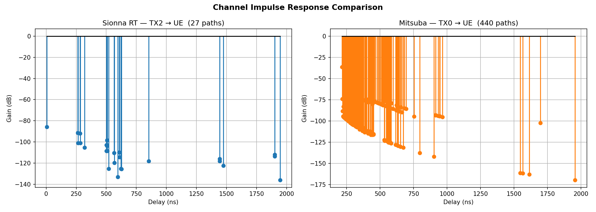
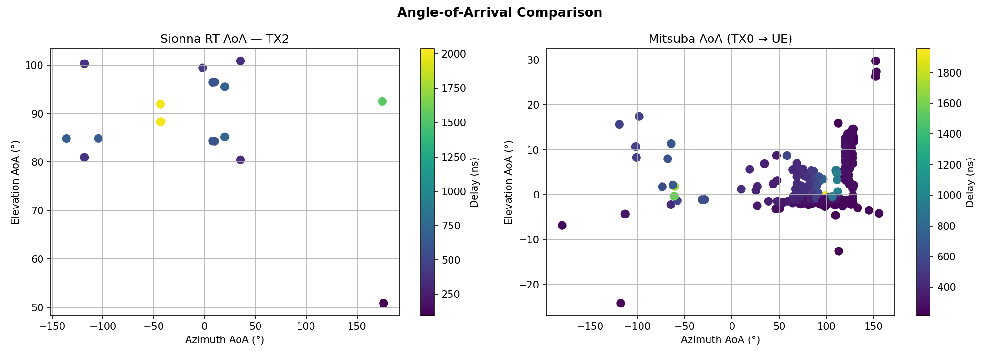
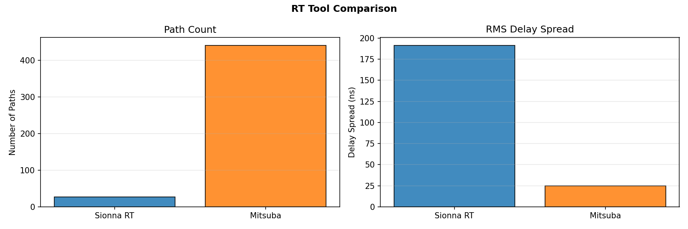

# 02 — RT Comparison

Loads the pre-generated HDF5 datasets produced by `01_generate_dataset.py`
and produces side-by-side comparisons of Sionna RT and Mitsuba ray-tracing results.

**Scene:** `Otaniemi_small/Otaniemi_small.xml`  
**Data:** `Otaniemi_small-results-2026-04-15-193158`

**Requires:** `sionna_dataset.h5` and `mitsuba_dataset.h5` in the data directory.

    Sionna  a shape  : (1, 1, 9, 16, 30, 1)
    Sionna  tau shape: (1, 9, 30)
    Mitsuba paths: 440

    Sionna best TX: 2, 27 valid paths

### CIR Comparison — Sionna RT vs Mitsuba

    Tool  Num Paths  Min Delay (ns)  Max Delay (ns)  Mean Delay (ns)  Std Delay (ns)  Min Amplitude  Max Amplitude  Mean Amplitude  Min Gain (dB)  Max Gain (dB)  Mean Gain (dB)  Total Gain (dB)
    Sionna RT         27        5.475925     1944.241943       745.218201      537.052124   1.564547e-07       0.000051        0.000007    -136.112228     -85.871185     -111.196236       -83.494433
      Mitsuba        440      215.797538     1956.072787       359.106089      193.640846   3.280606e-09       0.015457        0.000188    -169.680918     -36.217344      -90.958306       -35.616676
    
    RMS Delay Spread — Sionna: 191.24 ns  |  Mitsuba: 24.83 ns

### Angle of Arrival Comparison

### Delay Spread Comparison

## Analysis

Sionna RT models the full propagation physics including diffraction and polarisation,
while Mitsuba performs purely geometric ray tracing.

**RMS delay spread** — Sionna: `191.24 ns` | Mitsuba: `24.83 ns`

Key observations:
- **Path counts**: Sionna typically finds fewer but physically consistent paths;
  Mitsuba may trace many more purely geometric reflections.
- **Delay spread**: Large differences indicate the two tracers disagree on the
  multipath structure of the channel. Sionna's diffraction model tends to produce
  longer delays; Mitsuba's power-law model may concentrate energy at shorter delays.
- **AoA**: When available, angle-of-arrival spread reflects scatterer geometry.
  Disagreements between tools highlight model limitations in diffuse scattering.

The path statistics table above quantifies the spread numerically.  These outputs
feed directly into `03_localization.py` as the ground-truth channel dataset.
