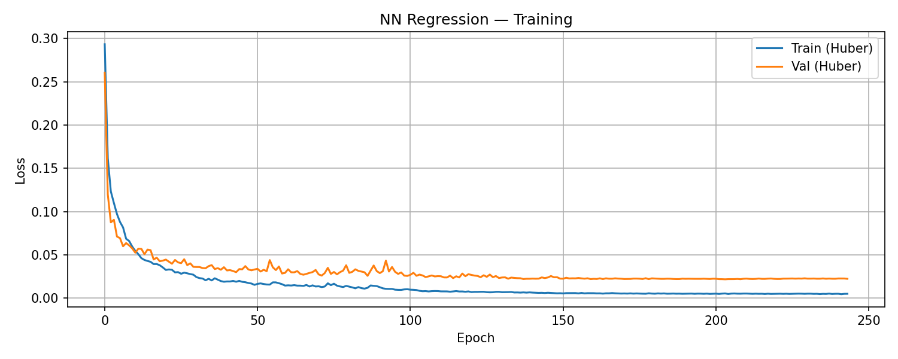
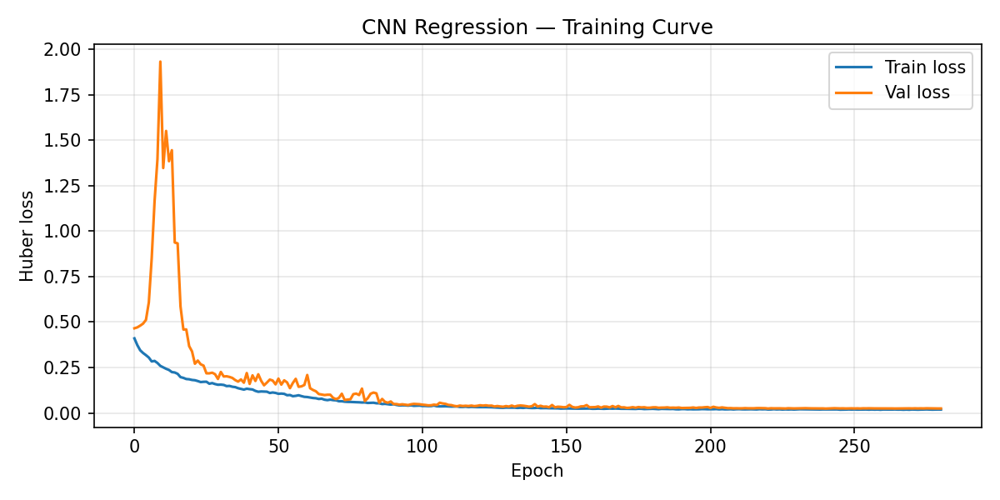
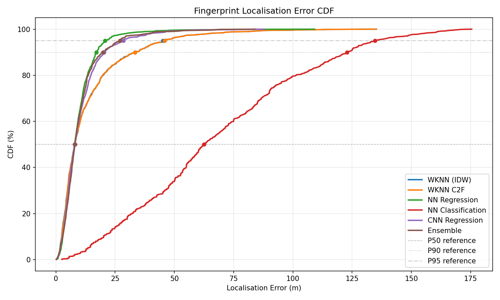
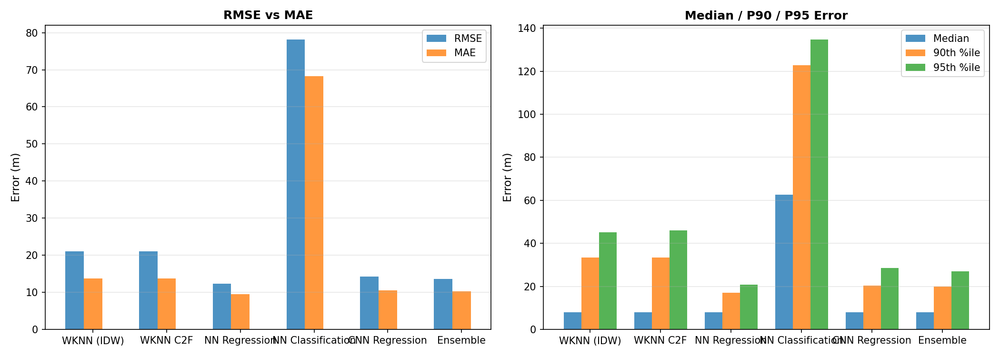
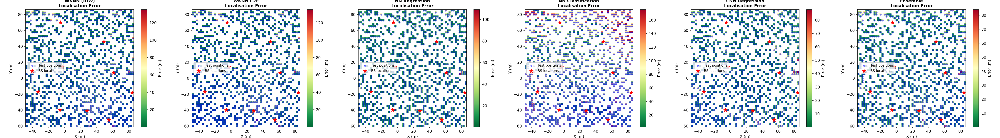

# 03 — Fingerprint Localization

Loads (or generates) the CSI fingerprint dataset and evaluates the enabled
localisation methods as configured in ``features_config.json``.

**Scene:** `Otaniemi_small/Otaniemi_small.xml`
**Data:** `Otaniemi_small-results-2026-04-15-193158`

**Requires:** `fingerprint_rt_dataset.h5` in the data directory
(generated by `01_generate_dataset.py`).

    Loaded fingerprint cache: (3186, 3690)

    Split: random  |  Train: 2230  |  Test: 956  |  Features: 3690

    wKNN  (k=3, p=3)  MAE=13.74 m  RMSE=21.04 m  Median=7.98 m  P90=33.38 m  P95=45.12 m

    wKNN C2F  (k=9, p=3, R=5 m, fallback=431/956)  MAE=13.77 m  RMSE=21.07 m  P90=33.41 m

### NN Regression — Training Curve

    NN Reg   MAE=9.53 m  RMSE=12.34 m  Median=7.90 m  P90=17.11 m  P95=20.75 m

    NN Clf   MAE=68.32 m  RMSE=78.10 m  Accuracy=0.0%

### CNN Regression — Training Curve

    CNN Reg  MAE=10.56 m  RMSE=14.21 m  P90=20.30 m  P95=28.49 m  [410 feat/TX × 9 TX]

    Ensemble (members=5)  MAE=10.29 m  RMSE=13.65 m  Median=8.00 m  P90=19.90 m  P95=27.03 m

### Localisation Error CDF

    ======================================================================
    LOCALIZATION SUMMARY
    ======================================================================
    Method                    MAE    RMSE   Median     P90     P95
    ---------------------------------------------------------------
      WKNN (IDW)            13.74   21.04     7.98   33.38   45.12
      WKNN C2F              13.77   21.07     8.01   33.41   45.94
      NN Regression          9.53   12.34     7.90   17.11   20.75
      NN Classification     68.32   78.10    62.52  122.75  134.68
      CNN Regression        10.56   14.21     7.85   20.30   28.49
      Ensemble              10.29   13.65     8.00   19.90   27.03

### Metrics Comparison

### Spatial Error Heatmaps

    Saved → Otaniemi_small-results-2026-04-15-193158/fingerprint_localization_results.csv
    Saved → Otaniemi_small-results-2026-04-15-193158/fingerprint_localization_summary.json

## Analysis

6 localisation method(s) were evaluated on a 956-sample
test set held out from the CSI fingerprint grid.

| Method | MAE (m) | RMSE (m) | Median (m) | P90 (m) | P95 (m) |
|--------|---------|----------|------------|---------|--------|
| WKNN (IDW) | 13.74 | 21.04 | 7.98 | 33.38 | 45.12 |
| WKNN C2F | 13.77 | 21.07 | 8.01 | 33.41 | 45.94 |
| NN Regression | 9.53 | 12.34 | 7.90 | 17.11 | 20.75 |
| NN Classification | 68.32 | 78.10 | 62.52 | 122.75 | 134.68 |
| CNN Regression | 10.56 | 14.21 | 7.85 | 20.30 | 28.49 |
| Ensemble | 10.29 | 13.65 | 8.00 | 19.90 | 27.03 |

**wKNN** is a non-parametric baseline: each test point is estimated as the
IDW-weighted centroid of its *k* nearest neighbours in the fingerprint library.
It is robust with small datasets but does not generalise beyond the grid.

**NN Regression** treats localisation as a direct coordinate regression problem.
With enough training data and a well-conditioned loss (Huber), it can outperform
wKNN in MAE while maintaining lower variance.

**NN Classification** maps each fingerprint to a discrete grid cell.  Accuracy
can be low when the grid is fine or the dataset is small — the network may fail
to separate adjacent-cell fingerprints from limited observations.

**CNN Regression** treats the feature matrix as a 2-D image where each column
is one BS.  Convolutional filters capture cross-BS spatial correlations that
fully-connected layers may miss.

The CDF plot above shows the empirical distribution of per-test-point errors.
A curve shifted leftmost indicates better performance for a given error budget.
