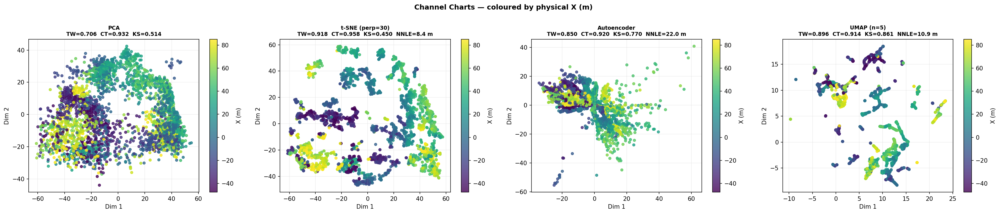
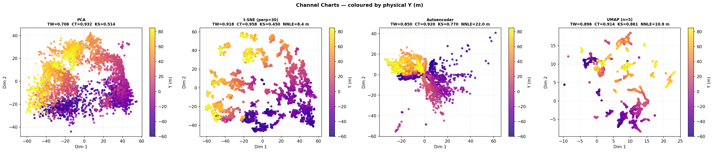
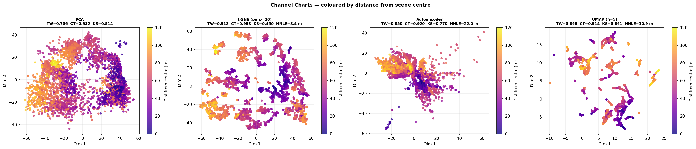
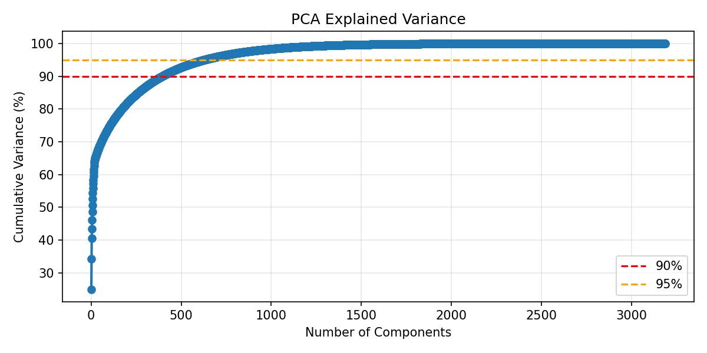

# 04 — Channel Charting

Applies dimensionality reduction to the CSI fingerprint matrix to produce a
2-D **channel chart** without using position labels.

Enabled methods (see ``features_config.json``):
- **PCA**
- **TSNE**
- **AUTOENCODER**
- **UMAP**

Quality metrics: Trustworthiness (TW), Continuity (CT), Kruskal Stress (KS).

**Scene:** `Otaniemi_small/Otaniemi_small.xml`
**Data:** `Otaniemi_small-results-2026-04-15-193158`

**Requires:** `fingerprint_rt_dataset.h5` in the data directory
(generated by `01_generate_dataset.py` or `03_localization.py`).

    Fingerprints: (3186, 3690)
    Dataset ready: N=3186 samples, 3690 features

    PCA: TW=0.7058  CT=0.9315  KS=0.5144

    t-SNE input: 50-D PCA projection
      t-SNE perplexity=5: TW=0.9062  KS=0.4586
      t-SNE perplexity=15: TW=0.9159  KS=0.4166
      t-SNE perplexity=30: TW=0.9178  KS=0.4505
      t-SNE perplexity=50: TW=0.9172  KS=0.5346
    t-SNE (best perp=30): TW=0.9178  CT=0.9576  KS=0.4505  NNLE=8.35 m

    AE: TW=0.8495  CT=0.9197  KS=0.7705  NNLE=22.00 m

    UMAP input: 50-D PCA projection
      UMAP n_neighbors=5: TW=0.8963  KS=0.8611
      UMAP n_neighbors=10: TW=0.8958  KS=0.8700
      UMAP n_neighbors=20: TW=0.8951  KS=0.8840
      UMAP n_neighbors=30: TW=0.8912  KS=0.8982
    UMAP (best n=5): TW=0.8963  CT=0.9139  KS=0.8611  NNLE=10.92 m

### Channel Charts — coloured by physical X coordinate

### Channel Charts — coloured by physical Y coordinate

### Channel Charts — coloured by distance from scene centre

### PCA Explained Variance

    ======================================================================
    CHANNEL CHARTING SUMMARY
    ======================================================================
             Method TW (↑ better) CT (↑ better) KS (↓ better) NNLE m (↓ better)
                PCA        0.7058        0.9315        0.5144               n/a
    t-SNE (perp=30)        0.9178        0.9576        0.4505              8.35
        Autoencoder        0.8495        0.9197        0.7705             22.00
         UMAP (n=5)        0.8963        0.9139        0.8611             10.92
    
    Saved → Otaniemi_small-results-2026-04-15-193158/channel_charting_metrics.csv
    ────────────────────────────────────────────────────────────
    METRIC WINNERS
    ────────────────────────────────────────────────────────────
      Best Trustworthiness (TW ↑)  : t-SNE (perp=30)
      Best Continuity       (CT ↑)  : t-SNE (perp=30)
      Best KS distance      (KS ↓)  : t-SNE (perp=30)
      Best NNLE             (↓ m)   : t-SNE (perp=30)
      Best overall avg rank         : t-SNE (perp=30)
    ────────────────────────────────────────────────────────────
    
    TW range : 0.7058 – 0.9178  (1.0 = ideal)
    CT range : 0.9139 – 0.9576  (1.0 = ideal)
    KS range : 0.4505 – 0.8611  (0.0 = ideal)
    NNLE range : 8.35 – 22.00 m  (0 = ideal)
    
      PCA
        TW=0.7058 (poor)  CT=0.9315 (good)  KS=0.5144 (poor)
    
      t-SNE (perp=30) ← best overall
        TW=0.9178 (good)  CT=0.9576 (good)  KS=0.4505 (poor)  NNLE=8.35 m
    
      Autoencoder
        TW=0.8495 (ok)  CT=0.9197 (good)  KS=0.7705 (poor)  NNLE=22.00 m
    
      UMAP (n=5)
        TW=0.8963 (ok)  CT=0.9139 (good)  KS=0.8611 (poor)  NNLE=10.92 m

    Saved channel charting cache → Otaniemi_small-results-2026-04-15-193158/channel_charting_dataset.h5

## Analysis — What the Metrics Mean and How to Improve

### Metrics at a Glance

| Metric | Range | Direction | What it measures |
|--------|-------|-----------|-----------------|
| **TW** (Trustworthiness) | 0 → 1 | ↑ higher is better | Do close neighbours in the 2-D chart stay close in the real RF space? Punishes *false neighbours* that appear close in the chart but are far apart in reality. |
| **CT** (Continuity) | 0 → 1 | ↑ higher is better | Do close neighbours in real RF space stay close in the chart? Punishes *tears* where nearby UE locations end up far apart in the chart. |
| **KS** (Kolmogorov–Smirnov distance) | 0 → 1 | ↓ lower is better | Does the chart's pairwise-distance distribution match the true geographic one? Near 0 = geometrically faithful map; near 1 = global scale heavily distorted. |

A **good channel chart** should have TW ≈ CT ≈ 1 and KS ≈ 0.

---

### Practical Interpretation

- **TW ≈ CT > 0.9** — the chart is usable as a radio-fingerprint map: nearby chart
  points correspond to nearby real locations.  Values below ~0.8 mean only the
  topology is preserved, not the metric.
- **KS close to 0** — the chart preserves absolute distances well enough for
  ranging-based localisation or handover triggering.
- **TW > CT** — more false neighbours than tears (typical of t-SNE / UMAP at
  high perplexity).
- **CT > TW** — the chart folds/tears the space; common with aggressive reduction
  on sparse datasets.
- **All metrics moderate** — the CSI fingerprint does not contain enough geometric
  information; adding more BSs or angular features will help most.

---

### How to Improve the Metrics

| Problem | Likely cause | Action |
|---------|-------------|--------|
| Low TW | Too many false neighbours | Reduce t-SNE perplexity or UMAP `n_neighbors`; add AE regularisation |
| Low CT | Chart tears / folds | Add a continuity-penalising loss; try triplet-loss or siamese AE |
| High KS | Global scale distorted | Add Sammon-mapping or distance-preserving loss; use more subcarriers / BSs |
| All metrics mediocre | Too few BSs / features | Stack CSI from all BSs; include AoA/AoD features |
| AE overfits small dataset | Few UE positions | Enlarge grid in `config.py` (reduce `GRID_SPACING`) or add dropout |

The single fastest practical improvement is to **use all base stations** in the
fingerprint vector and to **replace plain MSE reconstruction with a contrastive /
triplet-loss autoencoder** so the latent space is explicitly trained to be
geometrically consistent.
