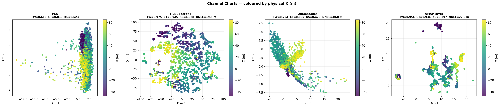
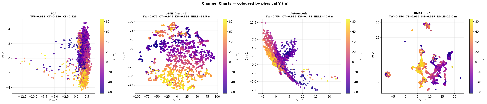
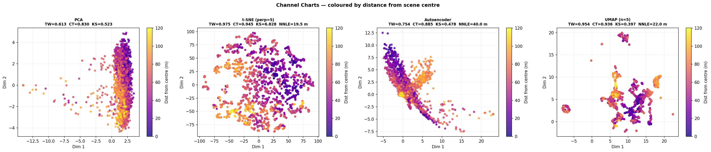
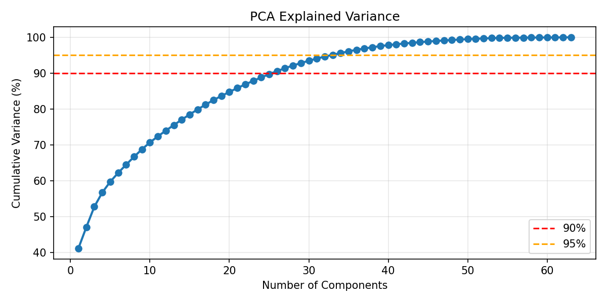

# 04 — Channel Charting

Applies dimensionality reduction to the CSI fingerprint matrix to produce a
2-D **channel chart** without using position labels.

Enabled methods (see ``features_config.json``):
- **PCA**
- **TSNE**
- **AUTOENCODER**
- **UMAP**

Quality metrics: Trustworthiness (TW), Continuity (CT), Kruskal Stress (KS).

**Scene:** `tommiScene/tommiScene.xml`
**Data:** `/home/jarikarp/study/Machine-Learning-for-Wireless-Comunications-E7340/Project/tommiScene`

**Requires:** `fingerprint_rt_dataset.h5` in the data directory
(generated by `01_generate_dataset.py` or `03_localization.py`).

    Fingerprints: (3069, 63)
    Dataset ready: N=3069 samples, 63 features

    PCA: TW=0.6130  CT=0.8296  KS=0.5230

    t-SNE input: 50-D PCA projection
      t-SNE perplexity=5: TW=0.9752  KS=6.8278
      t-SNE perplexity=15: TW=0.9729  KS=5.3745
      t-SNE perplexity=30: TW=0.9719  KS=3.9732
      t-SNE perplexity=50: TW=0.9663  KS=3.0851
    t-SNE (best perp=5): TW=0.9752  CT=0.9453  KS=6.8278  NNLE=19.46 m

    AE: TW=0.7540  CT=0.8848  KS=0.4778  NNLE=40.02 m

    UMAP input: 50-D PCA projection
      UMAP n_neighbors=5: TW=0.9535  KS=0.3969
      UMAP n_neighbors=10: TW=0.9487  KS=0.4054
      UMAP n_neighbors=20: TW=0.9334  KS=0.4341
      UMAP n_neighbors=30: TW=0.9238  KS=0.4059
    UMAP (best n=5): TW=0.9535  CT=0.9357  KS=0.3969  NNLE=22.04 m

### Channel Charts — coloured by physical X coordinate

### Channel Charts — coloured by physical Y coordinate

### Channel Charts — coloured by distance from scene centre

### PCA Explained Variance

    ======================================================================
    CHANNEL CHARTING SUMMARY
    ======================================================================
            Method TW (↑ better) CT (↑ better) KS (↓ better) NNLE m (↓ better)
               PCA        0.6130        0.8296        0.5230               n/a
    t-SNE (perp=5)        0.9752        0.9453        6.8278             19.46
       Autoencoder        0.7540        0.8848        0.4778             40.02
        UMAP (n=5)        0.9535        0.9357        0.3969             22.04
    
    Saved → /home/jarikarp/study/Machine-Learning-for-Wireless-Comunications-E7340/Project/tommiScene/channel_charting_metrics.csv
    ────────────────────────────────────────────────────────────
    METRIC WINNERS
    ────────────────────────────────────────────────────────────
      Best Trustworthiness (TW ↑)  : t-SNE (perp=5)
      Best Continuity       (CT ↑)  : t-SNE (perp=5)
      Best KS distance      (KS ↓)  : UMAP (n=5)
      Best NNLE             (↓ m)   : t-SNE (perp=5)
      Best overall avg rank         : UMAP (n=5)
    ────────────────────────────────────────────────────────────
    
    TW range : 0.6130 – 0.9752  (1.0 = ideal)
    CT range : 0.8296 – 0.9453  (1.0 = ideal)
    KS range : 0.3969 – 6.8278  (0.0 = ideal)
    NNLE range : 19.46 – 40.02 m  (0 = ideal)
    
      PCA
        TW=0.6130 (poor)  CT=0.8296 (ok)  KS=0.5230 (poor)
    
      t-SNE (perp=5)
        TW=0.9752 (good)  CT=0.9453 (good)  KS=6.8278 (poor)  NNLE=19.46 m
    
      Autoencoder
        TW=0.7540 (poor)  CT=0.8848 (ok)  KS=0.4778 (poor)  NNLE=40.02 m
    
      UMAP (n=5) ← best overall
        TW=0.9535 (good)  CT=0.9357 (good)  KS=0.3969 (poor)  NNLE=22.04 m

    Saved channel charting cache → /home/jarikarp/study/Machine-Learning-for-Wireless-Comunications-E7340/Project/tommiScene/channel_charting_dataset.h5

## Analysis — What the Metrics Mean and How to Improve

### Metrics at a Glance

| Metric | Range | Direction | What it measures |
|--------|-------|-----------|-----------------|
| **TW** (Trustworthiness) | 0 → 1 | ↑ higher is better | Do close neighbours in the 2-D chart stay close in the real RF space? Punishes *false neighbours* that appear close in the chart but are far apart in reality. |
| **CT** (Continuity) | 0 → 1 | ↑ higher is better | Do close neighbours in real RF space stay close in the chart? Punishes *tears* where nearby UE locations end up far apart in the chart. |
| **KS** (Kolmogorov–Smirnov distance) | 0 → 1 | ↓ lower is better | Does the chart's pairwise-distance distribution match the true geographic one? Near 0 = geometrically faithful map; near 1 = global scale heavily distorted. |

A **good channel chart** should have TW ≈ CT ≈ 1 and KS ≈ 0.

---

### Practical Interpretation

- **TW ≈ CT > 0.9** — the chart is usable as a radio-fingerprint map: nearby chart
  points correspond to nearby real locations.  Values below ~0.8 mean only the
  topology is preserved, not the metric.
- **KS close to 0** — the chart preserves absolute distances well enough for
  ranging-based localisation or handover triggering.
- **TW > CT** — more false neighbours than tears (typical of t-SNE / UMAP at
  high perplexity).
- **CT > TW** — the chart folds/tears the space; common with aggressive reduction
  on sparse datasets.
- **All metrics moderate** — the CSI fingerprint does not contain enough geometric
  information; adding more BSs or angular features will help most.

---

### How to Improve the Metrics

| Problem | Likely cause | Action |
|---------|-------------|--------|
| Low TW | Too many false neighbours | Reduce t-SNE perplexity or UMAP `n_neighbors`; add AE regularisation |
| Low CT | Chart tears / folds | Add a continuity-penalising loss; try triplet-loss or siamese AE |
| High KS | Global scale distorted | Add Sammon-mapping or distance-preserving loss; use more subcarriers / BSs |
| All metrics mediocre | Too few BSs / features | Stack CSI from all BSs; include AoA/AoD features |
| AE overfits small dataset | Few UE positions | Enlarge grid in `config.py` (reduce `GRID_SPACING`) or add dropout |

The single fastest practical improvement is to **use all base stations** in the
fingerprint vector and to **replace plain MSE reconstruction with a contrastive /
triplet-loss autoencoder** so the latent space is explicitly trained to be
geometrically consistent.
